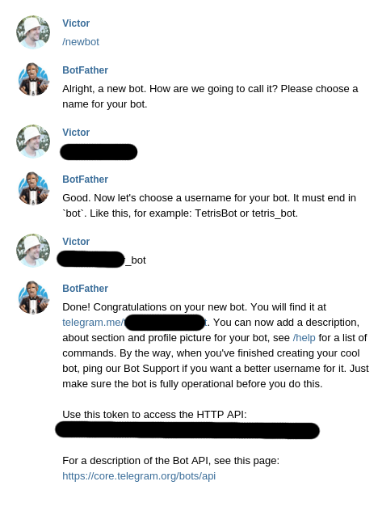
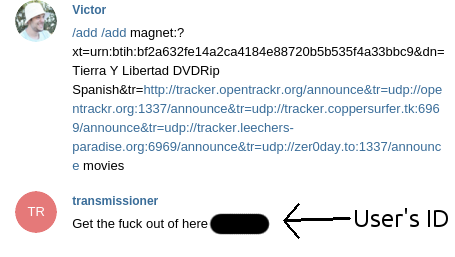
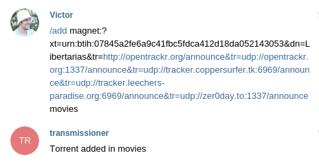

## Telegram bot for transmission

Quite simple bot for adding a torrent to transmission.
The torrent gets added by simply writting:
```
/add ${MAGNET_URL} ${DOWNLOAD_FOLDER}
```

### Transmission

The code asumes that transmission-daemon is already installed in your machine.
More information and a simple installation tutorial can be found here: https://github.com/Viperey/local-server-tutorial#transmission


### Parameters

#### TOKEN

In order to run this script you need to get an access token from [@BotFather](https://telegram.me/BotFather) following the instructions as in the picture:



Replace the obtained token in the code.


#### Transmission credentials

If you already followed the [tutorial](https://github.com/Viperey/local-server-tutorial#transmission) you might already have set your credentials for accessing your transmission daemon safely.
Copy those credentials in *TRANSMISSION_USER && TRANSMISSION_PASSWORD* variables. Without them, transmission will not adde any content given.


#### Relative path and folder name

In my case, since I'm also using Kodi on my daily basis I want to add some torrents in some specific folders, that way, at the moment a torrent finishes downloading, my library will get updated.
That's the reason for having some absolute prefix for downloading and the the need to specify a final folder.
In any case, the folder name is optional and in case is not defined, the value set in *DEFAULT_DOWNLOAD_FOLDER* is used.


#### Authorized users

In case you want to allow several people to add torrents to your transmission instance, you can add them to the *AUTHORIZED_USERS* list.
Value to be added to the list is a unique identifier that is printed in the screen when a unauthorized user tries to add a torrent.


### Examples




*Message for not authorized users*




*Result of adding a torrent to the queue*


### Bibliography
https://help.ubuntu.com/community/TransmissionHowTo#Installation
https://xpressrazor.wordpress.com/2014/04/30/using-transmission-remote-as-your-default-bittorrent-client/
https://wiki.archlinux.org/index.php/Transmission
https://forum.transmissionbt.com/viewtopic.php?t=11126
https://help.ubuntu.com/community/TransmissionHowTo#Add_a_Torrent
https://blog.flo.cx/2011/02/how-to-open-magnet-links-on-a-remote-transmission-daemon-with-one-click/comment-page-1/
https://core.telegram.org/bots
https://github.com/python-telegram-bot/python-telegram-bot
https://github.com/python-telegram-bot/python-telegram-bot/wiki/Extensions-%E2%80%93-Your-first-Bot #Really nice one, all the credit for them
